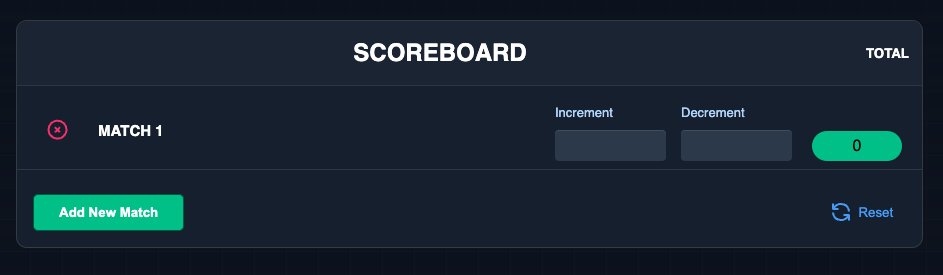

### Match Scoreboard

## Project Title: VanillaJS Match Scoreboard with Redux

## Description:

Welcome to the VanillaJS Match Scoreboard project, a sleek and intuitive web application designed to keep track of scores during matches. This project seamlessly blends the power of Vanilla JavaScript, HTML, Tailwind CSS, and Redux to provide a dynamic and responsive scoreboard experience.

## Key Features:

### Add New Match:

- Easily add a new match to the scoreboard with a user-friendly "Add Match" button.
 
### Increment and Decrement Inputs:

- Effortlessly update scores with the intuitive increment and decrement inputs.
Enjoy a real-time score update as you input value and press enter for each match.

### Total Score Calculation:

- Witness the magic of Redux as the total score dynamically adjusts with every enter press.
The state management system ensures accuracy and consistency in score calculations.

### Reset Functionality:

- Hit the "Reset" button to clear all scores and start fresh for every single match.
Conveniently wipe the slate clean without any hassle.

